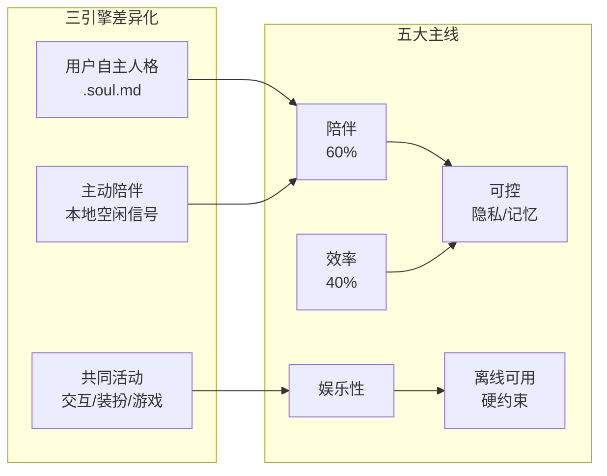
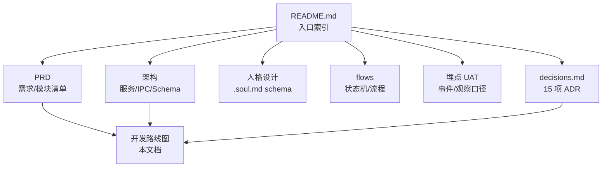
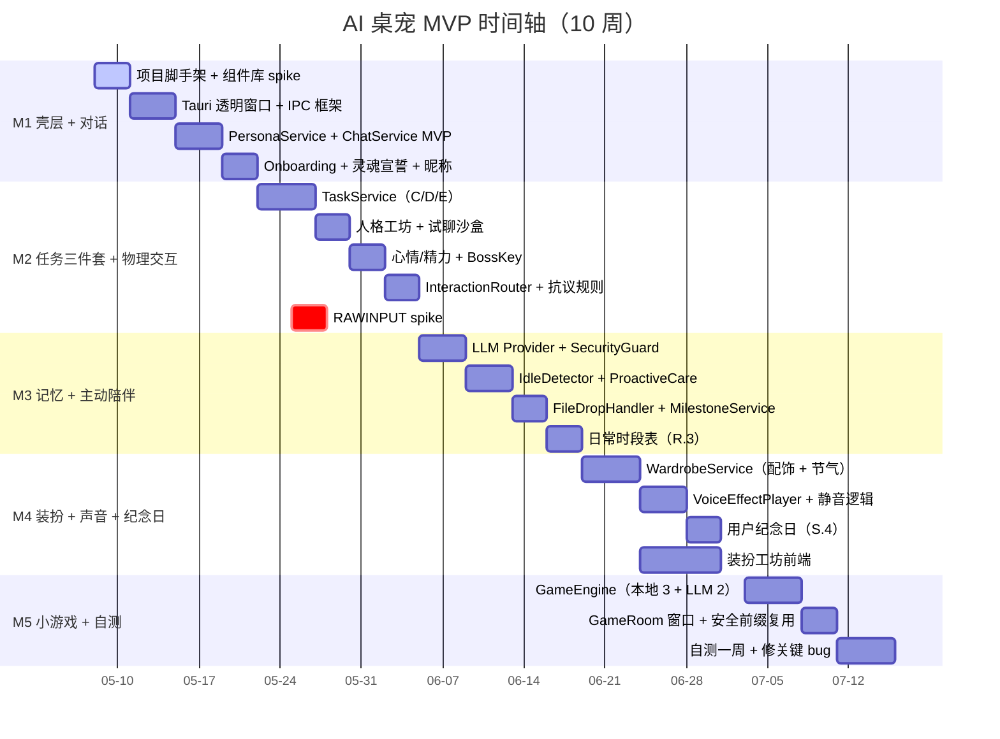
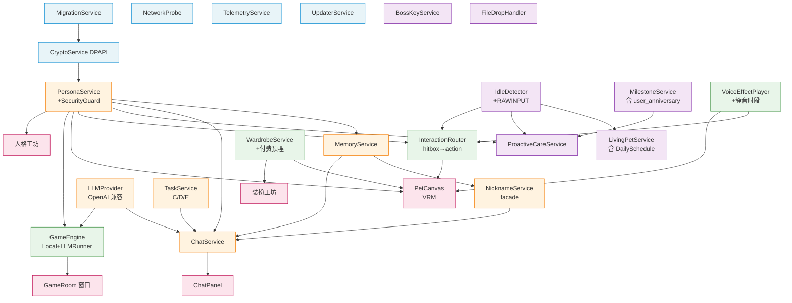
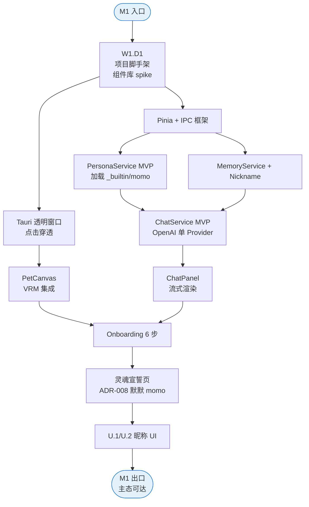
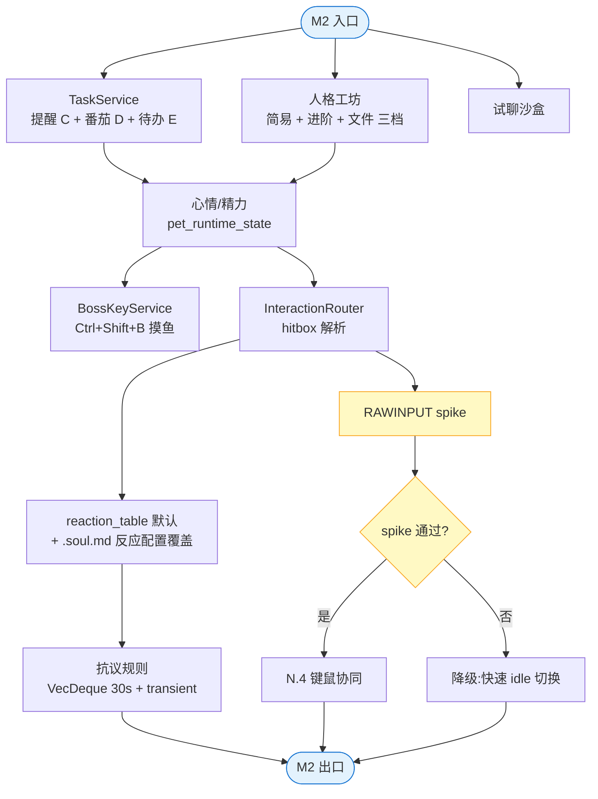
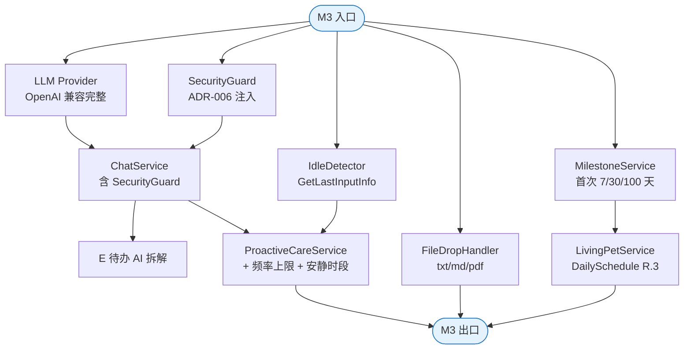
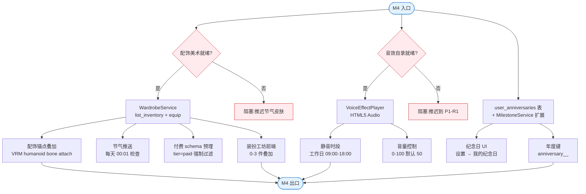
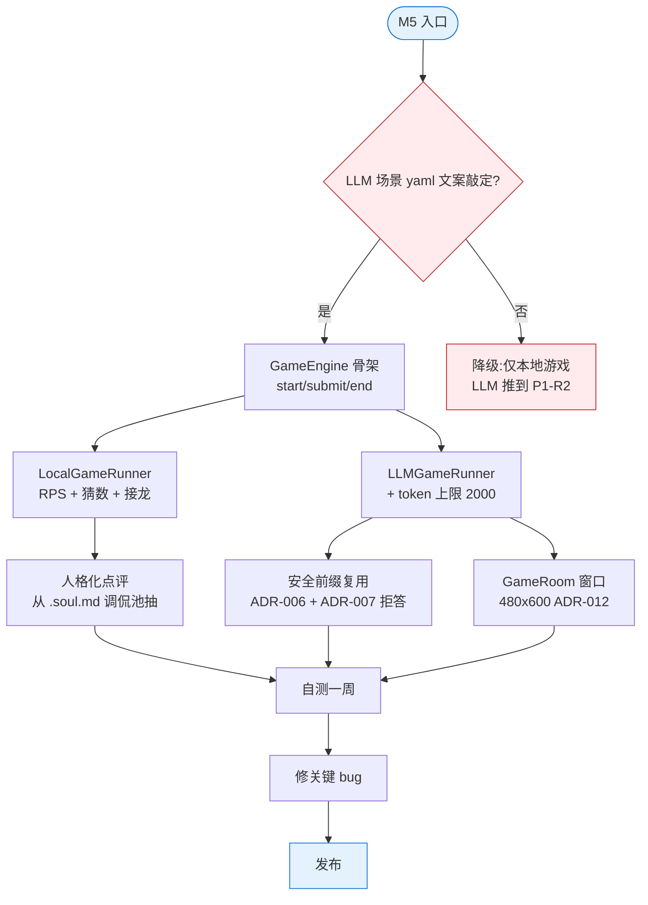

# AI 桌宠 开发路线图

- 适用阶段：M1 启动前（实施期入口）。
- 关联：15 项 ADR（详见 [decisions.md](../decisions.md)）。

> 单人项目，10 周 MVP。日期为相对周次（W1 起）；实际启动日自定。
> 工作约定见 [WORKFLOW.md](../WORKFLOW.md)；本文件只关心"做什么 / 什么时候做"。

---

## 1. 总览

### 1.1 三引擎与五大主线



### 1.2 关键约束速查

| 约束 | 含义 |
|---|---|
| **Local-first** | 不引入用户数据强制上传 |
| **用户自主权** | 不削弱用户对 .soul.md / 装扮 / 设置的控制 |
| **非养成** | 不引入流失 / 死亡 / 必须签到 |
| **隐私边界** | 不读应用名 / 窗口标题 / 输入内容 / 麦克风 |
| **安全护栏** | 任何人格 / 游戏不能覆盖系统安全前缀 |

### 1.3 文档导航



---

## 2. 项目时间轴（W1-W10）



> 节点标记：`active` = 进行中；`crit` = 关键路径节点（任一延期 → 整体延期）。

---

## 3. 模块依赖 DAG

### 3.1 全模块依赖图



### 3.2 模块 → milestone 占用矩阵

> 依 ADR-015：`ChatService + LLMProvider` 拆 B.3.a-f 跨 M1-M5；含 `ConversationStore` / `控制按钮区（模块 A 延伸）` / `hub 总面板` 三行。

| 模块 | M1 | M2 | M3 | M4 | M5 |
|---|---|---|---|---|---|
| **基础设施**（Migration / Crypto / Telemetry / Network / Updater） | 骨架 | — | 完善 | — | 自测埋点 |
| **PersonaService** | MVP（加载/激活）| 工坊 + 沙盒 | — | — | — |
| **MemoryService + NicknameService** | MVP | — | — | — | — |
| **ChatService + LLMProvider** | MVP（单 Provider）+ **B.3.a 形态 2 极简** | — | OpenAI 兼容完整 + SecurityGuard + **B.3.d 多 conversation** | — | — |
| **ConversationStore** | 表 schema 就位（I.1）| — | 完整 CRUD UI（随 B.3.d）| — | — |
| **控制按钮区**（模块 A 延伸）| — | **B.3.b 骨架**（0.5d）| — | — | — |
| **ChatPanel 形态 2 磁吸** | （B.3.a 极简内含）| **B.3.c 磁吸交互** | — | — | — |
| **hub 总面板**（形态 1）| — | — | — | **B.3.e 4 tab** | — |
| **形态 3 漫画气泡** | — | — | — | — | **B.3.f 角色窗内** |
| **TaskService**（C/D/E）| — | 全量 | — | — | — |
| **LivingPetService** | 自由活动初版 | mood/energy + 持久化 | DailySchedule（R.3）| — | — |
| **IdleDetector** | — | （N.4 spike）| 主体 + ProactiveCare | — | — |
| **ProactiveCareService** | — | — | 主体 + 频率上限 + 安静时段 | — | — |
| **BossKeyService** | （A.5 占位 emit）| 摸鱼模式接管 | — | — | — |
| **FileDropHandler** | — | — | 文本类全功能 + **接收源扩展（角色窗/各形态输入区，ADR-015）** | — | — |
| **MilestoneService** | — | — | 首次 7/30 天 | + user_anniversary | — |
| **InteractionRouter**（模块 N）| — | hitbox + reaction_table + 抗议 | — | — | — |
| **WardrobeService**（模块 O）| — | — | — | 配饰 + 节气 + 付费预埋 | — |
| **VoiceEffectPlayer**（模块 P）| — | — | — | 音效 + 静音时段 | — |
| **GameEngine**（模块 Q）| — | — | — | — | 全量（Local 3 + LLM 2）+ **hub 游戏 tab launcher** |

---

## 4. 关键路径（blocker chain）

任一节点延期 → 整体延期。

```mermaid
graph LR
    A[M1:Tauri + Vue 骨架<br/>组件库 spike] --> B[M1:PersonaService MVP<br/>+ ChatService MVP]
    B --> C[M1:Onboarding + Soul Pledge<br/>ADR-008]
    C --> D[M2:TaskService + 人格工坊]
    D --> E[M2:InteractionRouter<br/>+ 抗议规则]
    E --> F[M2:RAWINPUT spike<br/>决断 N.4]
    F --> G[M3:LLM Provider 完整<br/>+ SecurityGuard ADR-006]
    G --> H[M3:IdleDetector<br/>+ ProactiveCare]
    H --> I[M3:FileDrop + Milestone<br/>+ R.3 日常时段]
    I --> J[M4:WardrobeService<br/>blocker:配饰美术 ADR-003]
    J --> K[M4:VoiceEffectPlayer<br/>blocker:音效自录 ADR-010]
    K --> L[M4:用户纪念日 S.4]
    L --> M[M5:GameEngine<br/>blocker:场景 yaml ADR-007]
    M --> N[M5:自测一周]
    N --> O[发布]

    classDef critical fill:#ffebee,stroke:#c62828,stroke-width:2px
    class F,J,K,M critical
```



### 4.1 关键 spike 与决策点

| 节点 | 时机 | 决策内容 | 失败降级 |
|---|---|---|---|
| **桌宠渲染 spike（VRM）** | 立项期（已完成，从 Live2D 切换）| 配饰挂载点（humanoid bone）可行（启动/内存预算推到 M5 自测期）| 降级"整套皮肤"（配饰仅整体替换）|
| **组件库 spike** | M1 W1 第 1 天 | Naive UI vs Element Plus 哪个更适合 | 默认 Naive UI |
| **RAWINPUT spike** | M2 内 | 实现成本是否可控 | 降级"快速 idle 切换"近似信号（N.4 体验弱化）|
| **配饰美术管线就绪** | M4 启动前 | 8 件配饰 + 4 套节气资源齐 | 推迟节气皮肤到 M4 末或 P1-R1 |
| **音效自录交付** | M4 启动前 | 12-20 条 OGG 录制完成 | 推迟到 M4 末或 P1-R1 |
| **LLM 场景 yaml 文案** | M5 启动前 | 故事接龙 + 咖啡店老板拒答模板敲定 | 推迟 LLM 游戏到 P1-R2 |

---

## 5. 各 Milestone 详细

### 5.1 M1 壳层 + 对话（W1-W2，2 周）

**入口**：决策已敲定，VRM spike 通过。
**主交付**：核心 UI 跑通；快捷键稳定；Onboarding 6 步可走通到主态。



**主交付物**：

- Tauri + Vue 3 + TS + Pinia + Vite 项目脚手架
- 桌宠透明窗口（置顶 / 无边框 / 点击穿透）
- VRM 默默 momo 渲染（内置 3 个人格，但 M1 只用 momo）
- 对话面板 + 流式渲染 + OpenAI Provider
- Onboarding 6 步（灵魂宣誓 + Provider 引导 [可跳过]）
- U.1 桌宠昵称 + U.2 用户昵称 UI

### 5.2 M2 任务三件套 + 物理交互（W3-W4，2 周）

**入口**：M1 出口；VRM humanoid bone 配饰挂载点已验证。



**主交付物**：

- C 提醒系统（软/硬优先级，稍后上限 3 次）
- D 番茄钟（暂停/恢复/休眠校准）
- E 待办（创建/完成/AI 拆解占位 — M3 接 LLM）
- 人格工坊 GUI 三档编辑 + 试聊沙盒
- 心情/精力运行时状态 + 持久化
- 摸鱼模式（隐藏/恢复 < 200ms，缓冲提醒）
- N 物理交互（hitbox 反应、抗议非持久化）
- N.4 键鼠协同（若 RAWINPUT 通过）

### 5.3 M3 记忆 + 主动陪伴（W5-W6，2 周）

**入口**：M2 出口；LLM Provider 决定上线 OpenAI 兼容协议。



**主交付物**：

- LLM Provider 完整（OpenAI 协议 + 6 个 preset）
- SecurityGuard 注入（安全前缀 v1.0 + 地区补充）
- E 待办 AI 拆解（接 LLM）
- IdleDetector（GetLastInputInfo）
- ProactiveCareService（频率 4 次/日 + 2h 间隔 + 安静时段）
- L 文件拖入（.txt/.md/.pdf）
- MilestoneService（首次 7/30/100 天等）
- LivingPetService DailySchedule（R.3 桌宠日常时段）
- 自动更新 UpdaterService

### 5.4 M4 装扮 + 声音 + 纪念日（W7-W8，2 周）

**入口**：M3 出口；配饰美术（8 件 + 4 套节气）交付；音效包（12-20 条 OGG）录制完成。



**主交付物**：

- O.1 配饰系统（8 件）+ O.2 节气皮肤（4 套）
- O.3 付费 schema 预埋（`tier='paid'` 强制过滤）
- 装扮工坊前端
- P 声音表情（默认音效包 + 静音时段 + 音量）
- S.4 用户纪念日（添加 / 触达 / 年度去重）

### 5.5 M5 小游戏 + 自测（W9-W10，2 周）

**入口**：M4 出口；`game_scenes/{story_relay,cafe_owner}.yaml` 文案敲定。



**主交付物**：

- Q.1-Q.2 本地游戏（RPS / 猜数字 / 词语接龙）
- Q.3-Q.4 LLM 游戏（故事接龙 / 咖啡店老板）
- GameRoom 独立窗口（480 × 600）
- 性能调优（常驻 < 250MB / 安装包 < 80MB）
- 自测一周 + 修关键 bug
- 发布

---

## 6. 风险随手记

> 团队风格的"13 项风险登记表 + 缓解方案 SLA"已经被废除。下面只列我自己写代码时需要警惕的几条；遇到再补。

- **Tauri AV 误报**：M1 测试时如果安装包被 Defender 删掉，准备 SmartScreen 信誉申请文案。
- **WebView2 缺失**：老 Win10 启动失败；安装包内置 Bootstrapper 即可。
- **RAWINPUT 复杂**：M2 spike 卡住就降级到"快速 idle 切换"近似信号，不影响其他 N 子项。
- **物理动作美术工作量大**：12 个核心动作上限（ADR-004），复用 stretch / yawn 节省工作量。
- **VRM 内存超 250MB**：M4-M5 调优时跑 LOD 切换 / 低多边形 / 低分辨率贴图兜底。
- **GetLastInputInfo 在 RDP 不一致**：默认关闭模块 J 即可。
- **Tauri file-drop 跨版本断裂**：锁定 Tauri 2.x 版本，M3 集成测试覆盖。
- **Milestone 时区跨日漏触发**：本地时区 + 启动期幂等检查 + `milestones.id` PK 唯一。
- **DPAPI 跨用户切换异常**：作为 feature 暴露（账户绑定）。
- **LLM 游戏 token 月成本爆**：单次 2000 token 上限 + 设置可见消耗统计 + 告警。
- **节气推送被认为打扰**：默认每节气仅推 1 次；用户拒绝当年不再推。

---

## 7. 跟踪机制

- 任务粒度：**Milestone → Module → Task** 三层就够了，不强求 story / sub-task 拆分。
- 看板列：`Backlog / In Progress / Done`，按需补"Blocked"。
- 每个 milestone 末做一次 5 分钟自检：交付物清单是否齐、关键路径节点是否过、风险随手记是否有新条目。

### 7.1 文档同步

- 实施期发现 PRD / 架构与现实偏差 → 在同一次 commit 里改 docs。
- 重大决策变化 → 写一条新 ADR 到 [decisions.md](../decisions.md)。

---

## 8. 给自己的 4 条速读

1. **关键路径不容延期**：M2 RAWINPUT spike → M4 美术 + 音效就绪 → M5 LLM 场景 yaml → 自测。任一节点延期 → 整体延期。
2. **每个 milestone 2 周**，共 10 周。M1 立即可启动。
3. **自测 1 周不可砍**：自己 dogfood 一周再发；发现的 bug 不修不发。
4. **降级路线随手记**：每个 spike 节点都有 fallback；卡住先降级再走。

---

## 9. 下一步

```
M1 第 1 天:
  上午:Tauri 2.x + Vue 3 + TS + Pinia + Vite 项目脚手架
        组件库 spike（Naive UI vs Element Plus）
  下午:决定组件库;开始 PetCanvas 基础架子
        IPC 框架草搭 + 第一个 ping/pong

M1 第 1 周末:
  桌宠透明窗口 + VRM momo 渲染 + 基础点击
  ChatService MVP（单 Provider）+ 流式渲染
  MemoryService + NicknameService 骨架

M1 第 2 周末:
  Onboarding 6 步可走通（灵魂宣誓页用 ADR-008 文案）
  U.1 / U.2 昵称 UI
  系统托盘 + 快捷键（Ctrl+Alt+Space）
  M1 自检 → 进 M2
```
